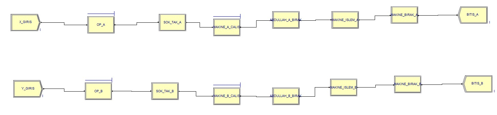

# CNC Tezgahlarında Operatör ve Makine Performans Analizi (Simülasyon)

## Problem
Bir operatörün (Apo) birden fazla CNC tezgahına hizmet verdiği sistemlerde oluşan bekleme süreleri ve iş yükü dengesizliği, makine verimliliğini olumsuz etkileyebilir.

## Amaç
Operatör ve CNC tezgahlarının farklı çalışma koşulları altında performansını analiz ederek sistem davranışını gözlemlemek.

## Yöntem
- Arena Simulation ile üretim sistemi modellenmiştir
- Operatörün birden fazla makineye hizmet verdiği yapı simüle edilmiştir
- Çevrim süresi, makine kullanım oranı ve bekleme süreleri analiz edilmiştir

## Sonuç
- Operatör kaynaklı bekleme süreleri gözlemlenmiştir
- CNC tezgahlarının kullanım oranları karşılaştırılmıştır
- Sistem performansını etkileyen temel faktörler belirlenmiştir

## Not
Bu çalışma, sistem davranışını anlamaya yönelik bir simülasyon taslağı olup karar destek amacıyla geliştirilmiştir.

## Kullanılan Araçlar
Arena, Excel
## Proje Görseli

